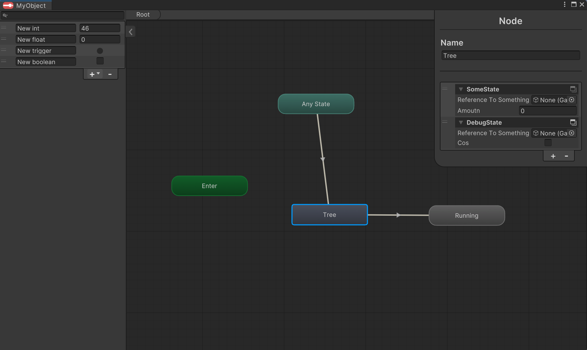

 
 

Framework was developed to speed up creation of state machines. The solution is designed to work with code-based state machines by adding visual layer for transitions and states.  It's clean and simple providing only the necessary tools, avoiding bloat. With State behaviours and tree structure it allows for complex state-machines.


## Key features
- Visual setup 
- Runtime visual feedback
- serializes scene-references
- Tree structure with sub states for nested state behaviours
- Runtime  parameter value change in editor (for testing purposes)
- List of state behaviours per state (for state reusing)
- Light and basic but easily extendable 
- No bloat
- parameter filtering
## Known Limitations
- No transitions between layers 
- no selection box (UX) 
- no layers 
## Installation
use this link for PackagerManager:
```
https://github.com/MLopusiewicz/StateMachineFramework.git?path=/Assets/StateMachineFramework/#release
```
 


## Working
Open general  editor with in Windows > State Machine Framework. It'll display a state machine of selected Gameobject. 


Or
 Click button in StateMachineFramework Inspector to create a **locked** window that will alwyas display this state machine. 
 
